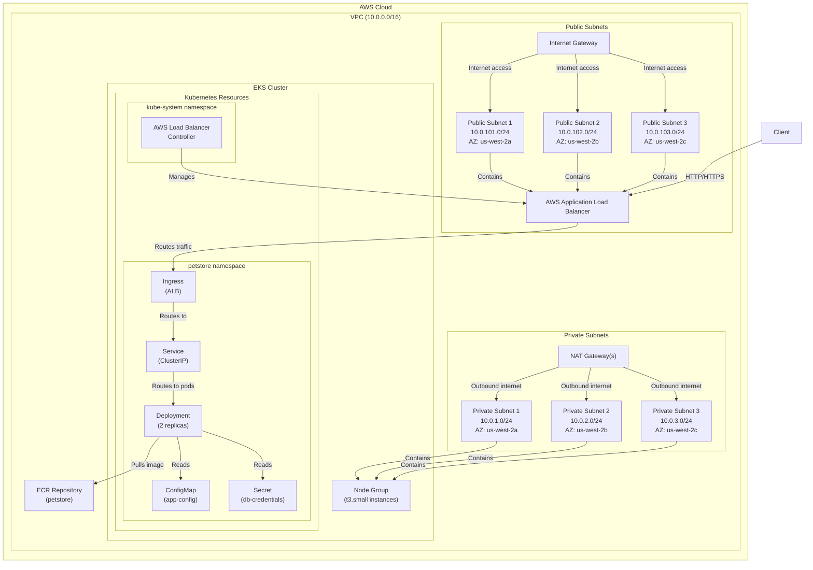
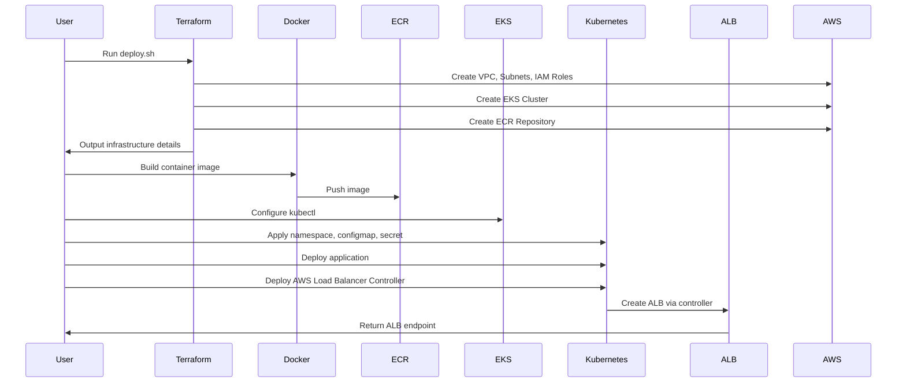

# Pet Store Application Deployment

This document provides comprehensive documentation for the Pet Store application deployment on AWS EKS.

## Architecture Overview

The Pet Store application is a containerized microservice deployed on AWS EKS (Elastic Kubernetes Service). It provides a RESTful API for managing pet store data, using SQLite as an embedded database for development environments with the option to use PostgreSQL for production.

### Key Components

1. **AWS Infrastructure**:
   - EKS Cluster for container orchestration
   - VPC with public and private subnets across 3 availability zones
   - NAT Gateways for outbound internet access from private subnets
   - AWS ECR (Elastic Container Registry) for storing Docker images
   - AWS Application Load Balancer (ALB) for ingress traffic

2. **Kubernetes Resources**:
   - Deployment with 2 replicas for high availability
   - Service for internal communication
   - Ingress for external access via ALB
   - ConfigMap for application configuration
   - Secret for database credentials
   - AWS Load Balancer Controller for managing ALB

3. **Application Components**:
   - Python-based API service
   - SQLite embedded database (can be configured for PostgreSQL)
   - Gunicorn as the WSGI server

## Infrastructure Diagram



## Deployment Flow


## Directory Structure

```
deployment/
├── docker/                # Docker configuration
│   ├── Dockerfile         # Container definition
│   ├── entrypoint.sh      # Container startup script
│   └── database_migration.py # Database migration script
├── kubernetes/            # Kubernetes manifests
│   ├── configmap.yaml     # Application configuration
│   ├── deployment.yaml    # Pod deployment definition
│   ├── ingress.yaml       # ALB ingress configuration
│   ├── kustomization.yaml # Kustomize configuration
│   ├── namespace.yaml     # Namespace definition
│   ├── secret.yaml        # Database credentials
│   └── service.yaml       # Service definition
├── scripts/               # Deployment scripts
│   ├── deploy.sh          # Main deployment script
│   └── cleanup.sh         # Resource cleanup script
├── terraform/             # Infrastructure as Code
│   ├── main.tf            # Main Terraform configuration
│   ├── variables.tf       # Variable definitions
│   ├── outputs.tf         # Output definitions
│   └── terraform.tfvars   # Variable values
└── workflows/             # CI/CD workflow definitions
```

## Configuration Details

### Terraform Resources

1. **VPC Configuration**:
   - CIDR Block: 10.0.0.0/16
   - 3 Public Subnets: 10.0.101.0/24, 10.0.102.0/24, 10.0.103.0/24
   - 3 Private Subnets: 10.0.1.0/24, 10.0.2.0/24, 10.0.3.0/24
   - NAT Gateway: Single for development, one per AZ for production

2. **EKS Cluster**:
   - Kubernetes Version: 1.24
   - Node Group: t3.small instances (2-5 nodes)
   - Managed Add-ons: CoreDNS, kube-proxy, VPC CNI

3. **IAM Roles and Policies**:
   - AWS Load Balancer Controller Role
   - ECR Access Policy for EKS nodes

### Kubernetes Resources

1. **Deployment**:
   - 2 Replicas
   - Resource Limits: 500m CPU, 512Mi Memory
   - Resource Requests: 200m CPU, 256Mi Memory
   - Health Checks: Liveness and Readiness probes on /api/v1/health

2. **Service**:
   - Type: ClusterIP
   - Port: 80 → 8080 (container port)

3. **Ingress**:
   - Type: ALB
   - Internet-facing
   - Health Check Path: /api/v1/health

4. **ConfigMap (app-config)**:
   - API_VERSION
   - ENVIRONMENT
   - LOG_LEVEL
   - PAGINATION_LIMIT
   - CORS_ORIGINS

5. **Secret (db-credentials)**:
   - DATABASE_URL

### Docker Configuration

1. **Base Image**: Python 3.9-slim
2. **Exposed Port**: 8080
3. **Web Server**: Gunicorn with 3 workers
4. **Security**: Runs as non-root user (petstore)
5. **Entrypoint Script**:
   - Waits for PostgreSQL if configured
   - Initializes the database
   - Starts the application

## Deployment Process

1. **Infrastructure Provisioning**:
   - Run `deploy.sh` script
   - Terraform creates AWS infrastructure
   - Outputs are captured for Kubernetes configuration

2. **Container Build and Push**:
   - Docker image is built from application code
   - Image is pushed to ECR repository

3. **Kubernetes Deployment**:
   - kubectl is configured to connect to EKS
   - Kubernetes manifests are updated with Terraform outputs
   - Application is deployed with Kustomize
   - AWS Load Balancer Controller is deployed with Helm

4. **Verification**:
   - Script waits for deployment to complete
   - Ingress URL is displayed for access

## Cleanup Process

1. **Resource Deletion**:
   - Run `cleanup.sh` script
   - Kubernetes resources are deleted in proper order
   - Docker images are removed from ECR
   - Terraform destroys all AWS infrastructure
   - Manual cleanup of IAM policies if needed

## Environment Variables

| Variable | Description | Source |
|----------|-------------|--------|
| DATABASE_URL | Database connection string | Secret |
| API_VERSION | API version | ConfigMap |
| ENVIRONMENT | Deployment environment | ConfigMap |
| LOG_LEVEL | Logging level | ConfigMap |
| PAGINATION_LIMIT | Number of items per page | ConfigMap |
| CORS_ORIGINS | Allowed CORS origins | ConfigMap |
## Security Considerations

1. **Network Security**:
   - Application runs in private subnets
   - Internet traffic goes through ALB only
   - Security groups restrict access

2. **Container Security**:
   - Non-root user in container
   - Image scanning enabled in ECR

3. **Authentication**:
   - IAM roles for service accounts (IRSA)
   - Least privilege permissions

### Security Group Configuration

The deployment uses several security groups to control network traffic:

1. **EKS Cluster Security Group**:
   - Created automatically by the EKS module
   - Controls access to the Kubernetes API server
   - Allows inbound traffic on port 443 from authorized sources
   - Allows outbound traffic to node security group

2. **Node Security Group**:
   - Created automatically by the EKS module
   - Controls traffic to and from the EKS worker nodes
   - Allows inbound traffic from the cluster security group
   - Allows specific inbound traffic for webhook services (port 9443)
   - Allows all outbound traffic for node operations

3. **Load Balancer Security Groups**:
   - Created dynamically by the AWS Load Balancer Controller
   - Allows inbound HTTP/HTTPS traffic from the internet
   - Allows outbound traffic only to the node security group on application ports

4. **Security Group Rules**:
   ```hcl
   node_security_group_additional_rules = {
     webhook_ingress_9443 = {
       description                   = "Allow cluster API to webhook service on port 9443"
       protocol                      = "tcp"
       from_port                     = 9443
       to_port                       = 9443
       type                          = "ingress"
       source_cluster_security_group = true
     }
   }
   ```

5. **Security Group Flow**:
   - Internet → ALB Security Group → Node Security Group → Pod
   - Pod → Node Security Group → Internet (for outbound traffic)
   - Control Plane → Cluster Security Group → Node Security Group → Webhook Services

## Scaling Considerations

1. **Horizontal Pod Autoscaling**:
   - Deployment can be scaled from 2 to 5 replicas
   - Node group can scale accordingly

2. **Regional Deployment**:
   - Multi-AZ deployment for high availability
   - Production environment uses one NAT Gateway per AZ

## Usage Instructions

### Dependencies and Prerequisites

Before deploying the Pet Store application, ensure you have the following dependencies installed and configured:

#### Required Tools and Versions

The deployment was tested with the following tool versions:

| Dependency | Version Used | Command to Check Version |
|------------|----------------|--------------------------|
| AWS CLI | v2.27.5 | `aws --version` |
| Terraform | v1.11.4 | `terraform --version` |
| kubectl | v1.27.1-eks-2f008fe | `kubectl version --client` |
| Helm | v3.17.3 | `helm version --short` |
| Docker/Podman | v4.9.3 (Podman) | `docker --version` |
| jq | v1.7 | `jq --version` |
| git | v2.43.0 | `git --version` |

Note: AWS IAM Authenticator is not required as the AWS CLI now includes EKS authentication capabilities.

#### AWS Account Requirements

- Active AWS account with admin permissions or specific IAM permissions for:
  - EC2, VPC, EKS, ECR, IAM, Load Balancer resources
  - Run `aws sts get-caller-identity` to verify your AWS identity and permissions

#### Network Requirements

- Outbound internet access for downloading dependencies
- Ability to connect to AWS APIs and EKS cluster endpoint
- Run `aws ec2 describe-vpcs --output json | jq '.Vpcs[0]'` to verify AWS connectivity

#### Local Environment Setup

```bash
# Verify all required tools are installed
echo "Checking required dependencies..."

# Check AWS CLI
aws --version || echo "AWS CLI not found or not in PATH"

# Check Terraform
terraform --version || echo "Terraform not found or not in PATH"

# Check kubectl
kubectl version --client || echo "kubectl not found or not in PATH"

# Check Helm
helm version --short || echo "Helm not found or not in PATH"

# Check Docker
docker --version || echo "Docker not found or not in PATH"

# Check jq
jq --version || echo "jq not found or not in PATH"

# Check git
git --version || echo "git not found or not in PATH"

# Check AWS IAM Authenticator
aws-iam-authenticator version || echo "AWS IAM Authenticator not found or not in PATH"

# Verify AWS credentials
aws sts get-caller-identity || echo "AWS credentials not configured properly"
```

### Deployment

To deploy the application:

```bash
cd deployment/scripts
./deploy.sh
```

This script will:
1. Provision the AWS infrastructure with Terraform
2. Build and push the Docker image to ECR
3. Configure kubectl to connect to the EKS cluster
4. Update Kubernetes configuration files with Terraform outputs
5. Deploy the application with Kustomize
6. Deploy the AWS Load Balancer Controller
7. Display the ingress URL when complete

### Cleanup

To clean up all AWS resources:

```bash
cd deployment/scripts
./cleanup.sh
```

This script will:
1. Delete all Kubernetes resources
2. Delete all images from ECR
3. Destroy all Terraform-managed infrastructure
4. Clean up any remaining resources

## Conclusion

The Pet Store application deployment uses modern infrastructure-as-code practices with Terraform and Kubernetes. The architecture follows AWS best practices for containerized applications, with proper separation of concerns between infrastructure provisioning and application deployment. The dynamic configuration approach ensures that the deployment can be easily replicated across different environments.
