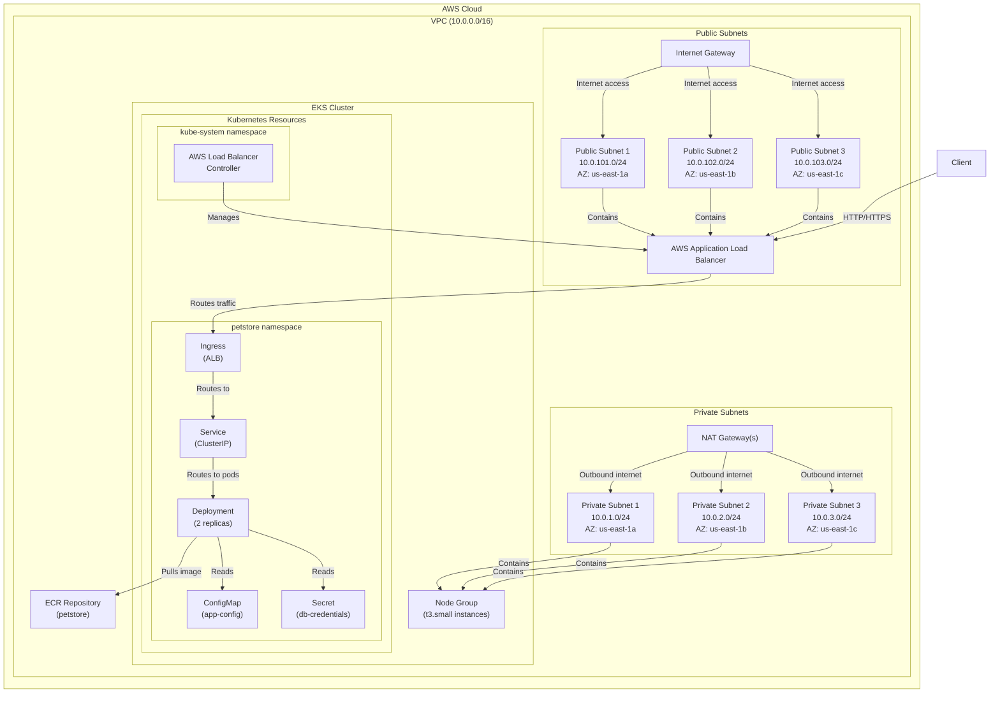
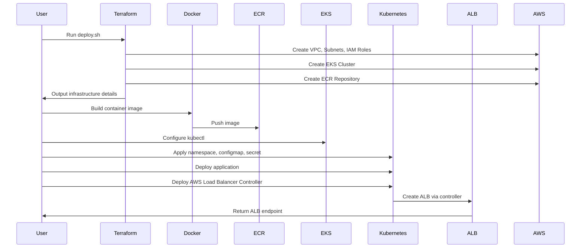

# Pet Store Application Deployment

This document provides comprehensive documentation for the Pet Store application deployment on AWS EKS.

## Architecture Overview

The Pet Store application is a containerized microservice deployed on AWS EKS (Elastic Kubernetes Service). It provides a RESTful API for managing pet store data, using SQLite as an embedded database for development environments with the option to use PostgreSQL for production.

More information about application, you can reference to design_docs & petstore-app folder

### Key Components

1. **AWS Infrastructure**:
   - EKS Cluster for container orchestration
   - VPC with public and private subnets across 3 availability zones
   - NAT Gateways for outbound internet access from private subnets
   - AWS ECR (Elastic Container Registry) for storing Docker images
   - AWS Application Load Balancer (ALB) for ingress traffic

2. **Kubernetes Resources**:
   - Deployment with 2 replicas for high availability
   - Service for internal communication
   - Ingress for external access via ALB
   - ConfigMap for application configuration
   - Secret for database credentials
   - AWS Load Balancer Controller for managing ALB
   - IngressClass resource for ALB configuration

3. **Application Components**:
   - Python-based API service
   - SQLite embedded database (can be configured for PostgreSQL)
   - Gunicorn as the WSGI server

## Infrastructure Diagram



## Deployment Flow


## Directory Structure

```
agent_workshop/
   deployment/
   ├── docker/                # Docker configuration
   │   ├── Dockerfile         # Container definition
   │   ├── entrypoint.sh      # Container startup script
   ├── kubernetes/            # Kubernetes manifests
   │   ├── configmap.yaml     # Application configuration
   │   ├── deployment.yaml    # Pod deployment definition
   │   ├── ingress.yaml       # ALB ingress configuration
   │   ├── ingress-class.yaml # ALB IngressClass definition
   │   ├── kustomization.yaml # Kustomize configuration
   │   ├── namespace.yaml     # Namespace definition
   │   ├── secret.yaml        # Database credentials
   │   ├── service.yaml       # Service definition
   │   ├── aws-load-balancer-controller-service-account.yaml # Service account for ALB controller
   │   └── aws-load-balancer-controller-values.yaml # Helm values for ALB controller
   ├── scripts/               # Deployment scripts
   │   ├── deploy.sh          # Main deployment script
   │   └── cleanup.sh         # Resource cleanup script
   ├── terraform/             # Infrastructure as Code
   │   ├── main.tf            # Main Terraform configuration
   │   ├── variables.tf       # Variable definitions
   │   ├── outputs.tf         # Output definitions
   │   └── terraform.tfvars   # Variable values
   └── workflows/             # CI/CD workflow definitions
```

## Configuration Details

### Terraform Resources

1. **VPC Configuration**:
   - CIDR Block: 10.0.0.0/16
   - 3 Public Subnets: 10.0.101.0/24, 10.0.102.0/24, 10.0.103.0/24
   - 3 Private Subnets: 10.0.1.0/24, 10.0.2.0/24, 10.0.3.0/24
   - NAT Gateway: Single for development, one per AZ for production
   - **Important**: Subnets must be tagged with `kubernetes.io/cluster/<cluster-name>: shared` for proper ALB integration

2. **EKS Cluster**:
   - Kubernetes Version: 1.28
   - Node Group: t3.small instances (2-5 nodes)
   - Managed Add-ons: CoreDNS, kube-proxy, VPC CNI
   - **Critical**: `cluster_endpoint_public_access = true` must be set to allow access to the EKS API from outside the VPC

3. **IAM Roles and Policies**:
   - AWS Load Balancer Controller Role with proper OIDC trust relationship
   - ECR Access Policy for EKS nodes
   - Service account for AWS Load Balancer Controller with IAM role annotation
   - **Critical**: The AWS Load Balancer Controller IAM role must have the `elasticloadbalancing:AddTags` permission, along with other ELB permissions

### Kubernetes Resources

1. **Deployment**:
   - 2 Replicas
   - Resource Limits: 500m CPU, 512Mi Memory
   - Resource Requests: 200m CPU, 256Mi Memory
   - Health Checks: Liveness and Readiness probes on /api/v1/health

2. **Service**:
   - Type: ClusterIP
   - Port: 80 → 8080 (container port)

3. **Ingress**:
   - Use `ingressClassName: alb` in the spec (not annotations)
   - Internet-facing
   - Health Check Path: /api/v1/health
   - Explicitly specify subnets in annotations if needed

4. **IngressClass**:
   - Name: alb
   - Controller: ingress.k8s.aws/alb
   - Annotations:
     - `ingressclass.kubernetes.io/is-default-class: "true"`
     - `meta.helm.sh/release-name: "aws-load-balancer-controller"`
     - `meta.helm.sh/release-namespace: "kube-system"`

5. **ConfigMap (app-config)**:
   - API_VERSION
   - ENVIRONMENT
   - LOG_LEVEL
   - PAGINATION_LIMIT
   - CORS_ORIGINS

6. **Secret (db-credentials)**:
   - DATABASE_URL

### Docker Configuration

1. **Base Image**: Python 3.9-slim
2. **Exposed Port**: 8080
3. **Web Server**: Gunicorn with 3 workers
4. **Security**: Runs as non-root user (petstore)
5. **Dependencies**:
   - **Critical**: Pin Werkzeug to version 2.2.3 to ensure compatibility with Flask 2.2.3
   - Install application dependencies from requirements.txt
6. **Dockerfile Consideration: File Ownership**:
   - **Critical**: All application files must be owned by the petstore user
   - Use `chown -R petstore:petstore /app` after copying application files but before switching to the petstore user
   - This ensures the application has write permissions to the SQLite database file
7. **Entrypoint Script**:
   - Waits for PostgreSQL if configured
   - Initializes the database
   - Starts the application

## Deployment Process

1. **Infrastructure Provisioning**:
   - Run `deploy.sh` script
   - Terraform creates AWS infrastructure
   - Outputs are captured for Kubernetes configuration

2. **Container Build and Push**:
   - Docker image is built from application code
   - Image is pushed to ECR repository

3. **Kubernetes Deployment**:
   - kubectl is configured to connect to EKS
   - Kubernetes manifests are updated with Terraform outputs
   - Create IngressClass resource before deploying the AWS Load Balancer Controller
   - Create service account for AWS Load Balancer Controller with IAM role annotation
   - Deploy the AWS Load Balancer Controller with Helm, setting `createIngressClassResource: false`
   - Deploy the application with Kustomize

4. **Verification**:
   - Script waits for deployment to complete
   - Ingress URL is displayed for access

## AWS Load Balancer Controller Setup

The AWS Load Balancer Controller requires special attention for proper setup:

1. **Service Account**:
   ```yaml
   apiVersion: v1
   kind: ServiceAccount
   metadata:
     name: aws-load-balancer-controller
     namespace: kube-system
     annotations:
       eks.amazonaws.com/role-arn: <IAM_ROLE_ARN>
   ```

2. **Required IAM Permissions**:
   The IAM role used by the AWS Load Balancer Controller must have the following permissions:
   ```json
   {
     "Version": "2012-10-17",
     "Statement": [
       {
         "Effect": "Allow",
         "Action": [
           "iam:CreateServiceLinkedRole",
           "ec2:DescribeAccountAttributes",
           "ec2:DescribeAddresses",
           "ec2:DescribeAvailabilityZones",
           "ec2:DescribeInternetGateways",
           "ec2:DescribeVpcs",
           "ec2:DescribeSubnets",
           "ec2:DescribeSecurityGroups",
           "ec2:DescribeInstances",
           "ec2:DescribeNetworkInterfaces",
           "ec2:DescribeTags",
           "ec2:GetCoipPoolUsage",
           "ec2:DescribeCoipPools",
           "elasticloadbalancing:DescribeLoadBalancers",
           "elasticloadbalancing:DescribeLoadBalancerAttributes",
           "elasticloadbalancing:DescribeListeners",
           "elasticloadbalancing:DescribeListenerCertificates",
           "elasticloadbalancing:DescribeSSLPolicies",
           "elasticloadbalancing:DescribeRules",
           "elasticloadbalancing:DescribeTargetGroups",
           "elasticloadbalancing:DescribeTargetGroupAttributes",
           "elasticloadbalancing:DescribeTargetHealth",
           "elasticloadbalancing:DescribeTags",
           "elasticloadbalancing:AddTags",
           "elasticloadbalancing:RemoveTags",
           "elasticloadbalancing:CreateListener",
           "elasticloadbalancing:CreateLoadBalancer",
           "elasticloadbalancing:CreateRule",
           "elasticloadbalancing:CreateTargetGroup",
           "elasticloadbalancing:DeleteListener",
           "elasticloadbalancing:DeleteLoadBalancer",
           "elasticloadbalancing:DeleteRule",
           "elasticloadbalancing:DeleteTargetGroup",
           "elasticloadbalancing:DeregisterTargets",
           "elasticloadbalancing:ModifyListener",
           "elasticloadbalancing:ModifyLoadBalancerAttributes",
           "elasticloadbalancing:ModifyRule",
           "elasticloadbalancing:ModifyTargetGroup",
           "elasticloadbalancing:ModifyTargetGroupAttributes",
           "elasticloadbalancing:RegisterTargets",
           "elasticloadbalancing:SetIpAddressType",
           "elasticloadbalancing:SetSecurityGroups",
           "elasticloadbalancing:SetSubnets",
           "elasticloadbalancing:SetWebAcl",
           "wafv2:GetWebACL",
           "wafv2:GetWebACLForResource",
           "wafv2:AssociateWebACL",
           "wafv2:DisassociateWebACL",
           "shield:GetSubscriptionState",
           "shield:DescribeProtection",
           "shield:CreateProtection",
           "shield:DeleteProtection",
           "ec2:AuthorizeSecurityGroupIngress",
           "ec2:RevokeSecurityGroupIngress",
           "ec2:CreateSecurityGroup",
           "ec2:CreateTags",
           "ec2:DeleteTags"
         ],
         "Resource": "*"
       }
     ]
   }
   ```
   
   You can use the AWS-managed policy `AWSLoadBalancerControllerIAMPolicy` or create a custom policy with these permissions. The most critical permissions that often cause deployment failures include:
   - `elasticloadbalancing:AddTags` - Required for tagging resources
   - `ec2:CreateSecurityGroup` and related permissions - Required for creating security groups
   - `ec2:CreateTags` - Required for tagging EC2 resources
   - `iam:CreateServiceLinkedRole` - Required for creating service-linked roles

3. **IngressClass Resource**:
   ```yaml
   apiVersion: networking.k8s.io/v1
   kind: IngressClass
   metadata:
     name: alb
     annotations:
       ingressclass.kubernetes.io/is-default-class: "true"
       meta.helm.sh/release-name: "aws-load-balancer-controller"
       meta.helm.sh/release-namespace: "kube-system"
   spec:
     controller: ingress.k8s.aws/alb
   ```

3. **Helm Values**:
   ```yaml
   clusterName: <CLUSTER_NAME>
   region: <REGION>
   vpcId: <VPC_ID>
   
   serviceAccount:
     create: false
     name: aws-load-balancer-controller
   
   createIngressClassResource: false
   ```

4. **Helm Installation**:
   ```bash
   helm install aws-load-balancer-controller eks/aws-load-balancer-controller \
     -n kube-system \
     -f aws-load-balancer-controller-values.yaml
   ```

## Cleanup Process

1. **Resource Deletion**:
   - Run `cleanup.sh` script
   - Kubernetes resources are deleted in proper order
   - Docker images are removed from ECR
   - Terraform destroys all AWS infrastructure
   - Manual cleanup of IAM policies if needed

## Environment Variables

| Variable | Description | Source |
|----------|-------------|--------|
| DATABASE_URL | Database connection string | Secret |
| API_VERSION | API version | ConfigMap |
| ENVIRONMENT | Deployment environment | ConfigMap |
| LOG_LEVEL | Logging level | ConfigMap |
| PAGINATION_LIMIT | Number of items per page | ConfigMap |
| CORS_ORIGINS | Allowed CORS origins | ConfigMap |

## Security Considerations

1. **Network Security**:
   - Application runs in private subnets
   - Internet traffic goes through ALB only
   - Security groups restrict access

2. **Container Security**:
   - Non-root user in container
   - Image scanning enabled in ECR

3. **Authentication**:
   - IAM roles for service accounts (IRSA)
   - Least privilege permissions

### Security Group Configuration

The deployment uses several security groups to control network traffic:

1. **EKS Cluster Security Group**:
   - Created automatically by the EKS module
   - Controls access to the Kubernetes API server
   - Allows inbound traffic on port 443 from authorized sources
   - Allows outbound traffic to node security group

2. **Node Security Group**:
   - Created automatically by the EKS module
   - Controls traffic to and from the EKS worker nodes
   - Allows inbound traffic from the cluster security group
   - Allows specific inbound traffic for webhook services (port 9443)
   - Allows all outbound traffic for node operations
   - **Important**: The EKS module automatically creates several security group rules. Do not attempt to create these rules manually to avoid duplicates.

3. **Load Balancer Security Groups**:
   - Created dynamically by the AWS Load Balancer Controller
   - Allows inbound HTTP/HTTPS traffic from the internet
   - Allows outbound traffic only to the node security group on application ports

4. **An Additional Security Group Rules only when EKS module version < 19.0**:
   - In 19.0 the module already creates rules for all port communication between cluster and nodes, no need for additional rules
   - Please carefully check version-dependent configurations and only implement them when the specified version conditions are met. Otherwise it will raise duplicate error.

   ```hcl
   node_security_group_additional_rules = {
     webhook_ingress_9443 = {
       description                   = "Allow cluster API to webhook service on port 9443"
       protocol                      = "tcp"
       from_port                     = 9443
       to_port                       = 9443
       type                          = "ingress"
       source_cluster_security_group = true
     }
   }
   ```

5. **Common Security Group Errors**:
   - `Error: [WARN] A duplicate Security Group rule was found on (sg-xxxxxxxxx)` - This occurs when you try to create a rule that already exists
   - To fix this, remove any custom security group rules that duplicate what the EKS module creates
   - Let the EKS module manage the default security group rules and only add rules for additional ports

6. **Security Group Flow**:
   - Internet → ALB Security Group → Node Security Group → Pod
   - Pod → Node Security Group → Internet (for outbound traffic)
   - Control Plane → Cluster Security Group → Node Security Group → Webhook Services

## Scaling Considerations

1. **Horizontal Pod Autoscaling**:
   - Deployment can be scaled from 2 to 5 replicas
   - Node group can scale accordingly

2. **Regional Deployment**:
   - Multi-AZ deployment for high availability
   - Production environment uses one NAT Gateway per AZ

## Usage Instructions

### Dependencies and Prerequisites

Before deploying the Pet Store application, ensure you have the following dependencies installed and configured:

#### Required Tools and Versions

The deployment was tested with the following tool versions:

| Dependency | Version Used | Command to Check Version |
|------------|----------------|--------------------------|
| AWS CLI | v2.27.5 | `aws --version` |
| Terraform | v1.11.4 | `terraform --version` |
| kubectl | v1.27.1-eks-2f008fe | `kubectl version --client` |
| Helm | v3.17.3 | `helm version --short` |
| Docker/Podman | v4.9.3 (Podman) | `docker --version` |
| jq | v1.7 | `jq --version` |
| git | v2.43.0 | `git --version` |

Note: AWS IAM Authenticator is not required as the AWS CLI now includes EKS authentication capabilities.

#### AWS Account Requirements

- Active AWS account with admin permissions or specific IAM permissions for:
  - EC2, VPC, EKS, ECR, IAM, Load Balancer resources
  - Run `aws sts get-caller-identity` to verify your AWS identity and permissions

#### Network Requirements

- Outbound internet access for downloading dependencies
- Ability to connect to AWS APIs and EKS cluster endpoint
- Run `aws ec2 describe-vpcs --output json | jq '.Vpcs[0]'` to verify AWS connectivity

#### Local Environment Setup

```bash
# Verify all required tools are installed
echo "Checking required dependencies..."

# Check AWS CLI
aws --version || echo "AWS CLI not found or not in PATH"

# Check Terraform
terraform --version || echo "Terraform not found or not in PATH"

# Check kubectl
kubectl version --client || echo "kubectl not found or not in PATH"

# Check Helm
helm version --short || echo "Helm not found or not in PATH"

# Check Docker
docker --version || echo "Docker not found or not in PATH"

# Check jq
jq --version || echo "jq not found or not in PATH"

# Check git
git --version || echo "git not found or not in PATH"

# Verify AWS credentials
aws sts get-caller-identity || echo "AWS credentials not configured properly"
```

### Deployment

To deploy the application:

```bash
cd deployment/scripts
./deploy.sh
```

This script will:
1. Provision the AWS infrastructure with Terraform
2. Build and push the Docker image to ECR
3. Configure kubectl to connect to the EKS cluster
4. Update Kubernetes configuration files with Terraform outputs
5. Create IngressClass and service account for AWS Load Balancer Controller
6. Deploy the AWS Load Balancer Controller with Helm
7. Deploy the application with Kustomize
8. Display the ingress URL when complete

### Cleanup

To clean up all AWS resources:

```bash
cd deployment/scripts
./cleanup.sh
```

This script will:
1. Delete all Kubernetes resources
2. Delete all images from ECR
3. Destroy all Terraform-managed infrastructure
4. Clean up any remaining resources

## Troubleshooting

### Common Issues

1. **EKS API Endpoint Not Accessible**:
   - Ensure `cluster_endpoint_public_access = true` is set in Terraform
   - Check security group rules to allow access to the EKS API endpoint

2. **AWS Load Balancer Controller Not Working**:
   - Verify the service account has the correct IAM role annotation
   - Check that the IngressClass resource is created before the controller
   - Set `createIngressClassResource: false` in Helm values to avoid conflicts
   - Ensure the IAM role has the necessary permissions, especially `elasticloadbalancing:AddTags`
   - Check the controller logs for specific permission errors: `kubectl logs -n kube-system deployment/aws-load-balancer-controller`

3. **ALB Not Created for Ingress**:
   - Ensure subnets are tagged correctly with `kubernetes.io/cluster/<cluster-name>: shared`
   - Use `ingressClassName: alb` in the Ingress spec instead of annotations
   - Check AWS Load Balancer Controller logs for errors

4. **Pods Cannot Pull Images from ECR**:
   - Verify the node IAM role has permissions to access ECR
   - Check that the ECR repository exists and contains the expected image

5. **Pods in CrashLoopBackOff with Werkzeug Import Error**:
   - If you see errors like `ImportError: cannot import name 'url_quote' from 'werkzeug.urls'`, this is due to a version incompatibility between Flask 2.2.3 and newer Werkzeug versions
   - Fix: Pin Werkzeug to version 2.2.3 in your Dockerfile before installing other dependencies:
     ```dockerfile
     RUN pip install --no-cache-dir werkzeug==2.2.3 && \
         pip install --no-cache-dir -r requirements.txt
     ```
   - This ensures Flask gets the compatible Werkzeug version it needs

6. **SQLite Database Write Permission Errors**:
   - If you see errors like `sqlalchemy.exc.OperationalError: (sqlite3.OperationalError) attempt to write a readonly database`, this is due to file permission issues
   - Fix: Ensure the application files are owned by the non-root user running the container:
     ```dockerfile
     # Copy application code
     COPY petstore-app/ .
     
     # Create non-root user and give ownership of files
     RUN groupadd -r petstore && \
         useradd -r -g petstore -d /app -s /sbin/nologin petstore && \
         chown -R petstore:petstore /app
     
     # Switch to non-root user
     USER petstore
     ```
   - The order is important: copy files, set ownership, then switch user
7. **Output defined in terraform outputs.tf may duplicated name with resource defined in main.tf**
   - for example: An output named "eks_cluster_name" was already defined at main.tf:137,1-26. Output names must be unique within a module.
   - Fix: Avoid duplicate output definitions in the Terraform configuration. The same output variables are defined in both main.tf and outputs.tf file.

## Conclusion

The Pet Store application deployment uses modern infrastructure-as-code practices with Terraform and Kubernetes. The architecture follows AWS best practices for containerized applications, with proper separation of concerns between infrastructure provisioning and application deployment. The dynamic configuration approach ensures that the deployment can be easily replicated across different environments.
## Lessons Learned

During the deployment process, several key lessons were learned:

1. **Dependency Management**:
   - Flask 2.2.3 requires Werkzeug 2.2.x, but pip installs the latest version (3.x) by default
   - Always pin critical dependencies in Dockerfiles to avoid compatibility issues

2. **EKS Version Compatibility**:
   - Use supported Kubernetes versions for EKS (1.28 instead of 1.24)
   - Check AWS documentation for the latest supported versions

3. **IAM Permissions for AWS Load Balancer Controller**:
   - The AWS Load Balancer Controller requires specific IAM permissions to function correctly
   - Missing permissions like `elasticloadbalancing:AddTags` will prevent the controller from creating resources
   - Use the AWS-managed policy `AWSLoadBalancerControllerIAMPolicy` or create a custom policy with all required permissions
   - Other critical permissions include:
     - EC2 permissions (`ec2:CreateSecurityGroup`, `ec2:AuthorizeSecurityGroupIngress`, etc.)
     - Tag permissions (`ec2:CreateTags`, `ec2:DeleteTags`)
     - Service-linked role permissions (`iam:CreateServiceLinkedRole`)
   - Check controller logs for specific permission errors when troubleshooting

4. **Security Group Management**:
   - Terraform modules may create duplicate security group rules that need to be managed.
   - Use `node_security_group_additional_rules` to add custom rules to the node security group
   - **Critical**: When using the EKS Terraform module = 19, Don't define `node_security_group_additional_rules`, the default rule will accept all request from Controlplan.
   - Avoid creating separate security groups with rules that might conflict with those created by the EKS module
   - If you encounter errors like `Error: [WARN] A duplicate Security Group rule was found on (sg-xxxxxxxxx)`, review your security group configurations and remove any duplicate rules

5. **Container File Permissions**:
   - When running containers as non-root users (a security best practice), ensure application files are owned by that user
   - The order of operations in a Dockerfile matters - set file ownership after copying files but before switching to the non-root user
   - For file-based databases like SQLite, write permissions are critical for normal operation
   - Use `chown -R petstore:petstore /app` to ensure the application has proper permissions to write to the database

6. **Error Logging and Diagnostics**:
   - Detailed error logs are essential for diagnosing container startup issues
   - Use `kubectl logs` and `kubectl describe` to investigate deployment problems
   - For AWS Load Balancer Controller issues, check the logs with `kubectl logs -n kube-system deployment/aws-load-balancer-controller`
   - For database permission issues, look for errors like `attempt to write a readonly database` in the application logs

These lessons have been incorporated into this documentation to help future deployments avoid common pitfalls.
## Potential Policy Blockers

When deploying the AWS Load Balancer Controller, the most common policy-related issue is missing IAM permissions. The controller requires a comprehensive set of permissions across multiple AWS services:
- Elastic Load Balancing permissions (creating and managing load balancers, target groups, listeners)
- EC2 permissions (security groups, network interfaces, VPC resources)
- IAM permissions (service-linked roles)
- Tag permissions (for both ELB and EC2 resources)

The most reliable solution is to use the AWS-managed policy `AWSLoadBalancerControllerIAMPolicy` which contains all the necessary permissions for the controller to function properly. If using a custom policy, ensure it includes all the permissions listed in the "Required IAM Permissions" section above, especially the `elasticloadbalancing:AddTags` permission which is commonly missing.
